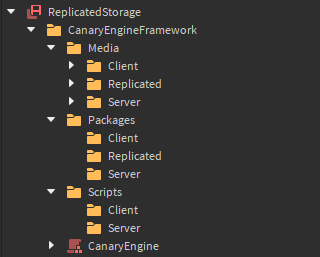

# File Structure

The CanaryEngine file structure aims to be easy to understand, easy to edit, and extremely customizable. Here's a look at the default file structure:

Notice how `Media` and `Packages` each have their own context specific folders? In each of these folders, goes the content for that context. For example, `EngineServer/Media/` shares the same behavior with [ServerStorage](https://create.roblox.com/docs/reference/engine/classes/ServerStorage). In this case, replicated shares behavior with [ReplicatedStorage](https://create.roblox.com/docs/reference/engine/classes/ReplicatedStorage).

The only acception here is with the `EngineScripts` folder, you cannot have a replicated script which runs both client and server sided as of writing this. You can organize these folders however you want, by adding new folders inside and placing new content inside. Please note that the folders already inside each media folder is just a template for easy startups, this does not have to be kept the way it is.

Another feature of CanaryEngine is the way you can create your own file structure, in the plugin, all you have to do is select the destination folders for each folder that is required. (eg: Media, Packages, and Scripts). Doing this also allows you to organize more of your own way. Have lots of libraries you need to store? Just create a new 'Libraries' folder that can be used alongside the required ones!

As a conclusion, **do not** move any folders that have already been placed where they are (aside from the folders inside of media), as it will cause CanaryEngine to error.