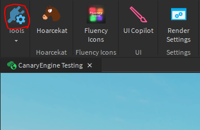

# Framework Updates

To some, updating can be a lengthy and confusing process. With this tutorial, we hope to minimize the amount of people that are asking for help during the update process.

### Reminders

Whenever we create a new release on github, these changes are automatically pushed to the plugin via `HttpService`. This means that once you open studio, you will be prompted to update your version of CanaryEngine. Note that sometimes you will also have to update your plugin as well, so check to make sure that there are no actual plugin updates available. Not updating your plugin could result in some unexpected behavior such as this:

### Update Process

First and foremost, update your Canary Studio plugin. This ensures that upon updating, your plugin is the most up-to-date and errors aren't likely to happen. You can find the plugin manager here: 

If a plugin update is available, make sure to update your plugin for reasons mentioned before. Now that you have updated your plugin, open the Canary Studio `Install Settings` menu. This allows you to install, update, and uninstall frameworks. For updating, make sure to press the update button. You will be prompted to update, and then you are done!