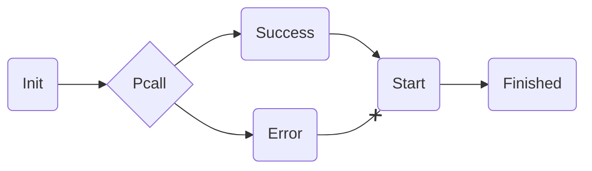
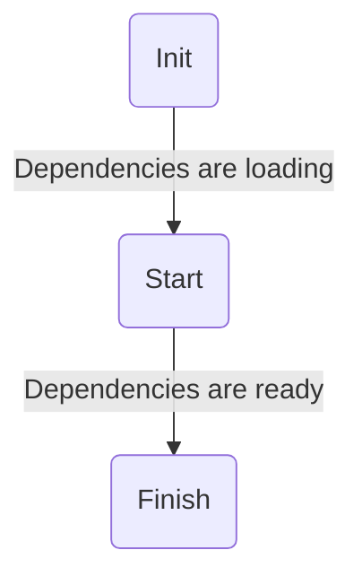

# Controllers

The controller object is an object that allows you to create data structures catered towards controlling the game, per the name. Think of it similar to a service in another framework like Knit. New Controllers cannot be created after `.Start` is finished.

## Usage

Setting up a controller is a simple as calling the `Controller` function. The preferred way to do this is shown below.

```lua
local function Init()
    print("Initialized!")
end

local function Start()
    print("Started!")
end

return Lumin.Controller("MyController", {
    Init = Init,
    Start = Start,
})
```

That is an example of the most minimal controller, that includes all of the required items. With this, you include as many other functions, methods, or properties as you please.

## Recommended Items

For controllers, the amount of recommended items is very minimal. These exist to streamline certain processes that may cause a dependency to be unavailable, and also fix race conditions. The list can be seen below.

- `Init`
- `Start`

The functionality of these are explained in the [loading section.](#loading)

## Loading



Above is a diagram of how every controller loads. Dependencies of controllers will become available after `Start` is called as seen in order below:



This is how dependencies eventually become available in a controller's lifecycle. Once we get to the `Finish` step, they can be used anywhere within the controller as new ones cannot be created after the framework has started. There are alternatives to this, however, and they can be done using [dependency injection.](./dependency-injection.md)

## Dependency Use

To use other dependencies, all you have to do is use `require` on the module as you normally would. You will get the correct type inferences and functions along with this as well.