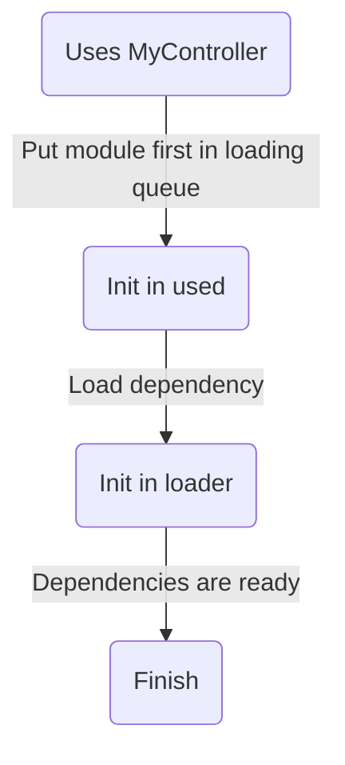

# Dependencies

Dependencies can sometimes be confusing. If not done correctly, they can lead to race conditions and what seems like never-ending errors. Lumin Framework has a way to fix this and it is a simple and quick solution to apply to your code.

## Usage

Access to this feature can be achieved by using the `.Uses` property of controllers. This a defined table of all of the dependencies that your module uses.

#### Module 1

```luau
local MyController = require(script.Parent.MyController)

local function Init()
    print("Loaded second!")
end

return Lumin.New({
    Uses = {MyController}
    Init = Init
})
```

#### Module 2

```luau
local function Init()
    print("Loaded first!")
end

return Lumin.New({
    Init = Init,
})
```

## Loading

The load order differs from the default but not too much. Here's a diagram of it.


