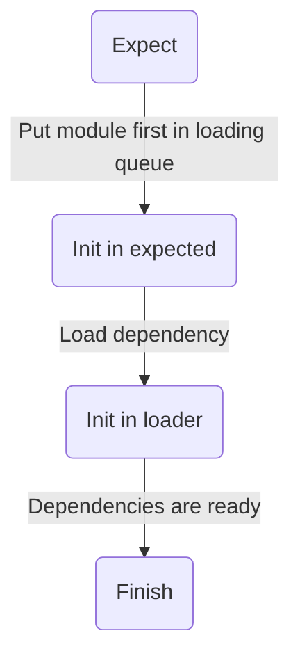

# Dependency Injection

Dependency injection is an efficient way to expect controllers to be loaded by a specific timeframe. These are loaded outside of the default loading stack and queued first before the default loading stack.

## Usage

Access to dependency injection can be gained by using `.Expect` and providing the controller you want to inject first and foremost. An example is shown below.

::: code-group

```lua [Module 1]
local MyController = Lumin.Expect(require(script.Parent.MyController))

local function Init()
    print("Loaded second!")
end

return Lumin.Controller("MyOtherController", {
    Init = Init
})
```

```lua [Module 2]
local function Init()
    print("Loaded first!")
end

return Lumin.Controller("MyController", {
    Init = Init,
})
```

:::

## Loading

The load order differs from the default but not too much. Here's a diagram of it.

