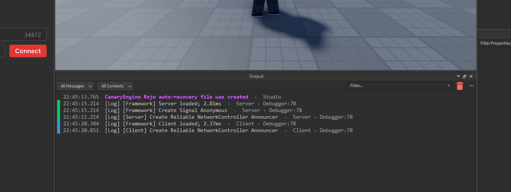

# Setup

Setting up LuminFramework is easy. It was made to be easy for anyone to use, and for existing games to make use of. Inserting is easy as dragging and dropping and a few tweaks if you need.

:::danger
You must you use a server script to start the framework or else unexpected events will occur.
:::

### Initialize the Framework

Initializing the framework is as simple as requiring the main module and you are done. Once you do this, you may see a few things in the output.

You will see the above for both the client and the server. This is the amount of time it took for the framework to start up, in milliseconds. If you want to benchmark further, this API is available on the main module, `LoadTime`.

And that's about it! Moving on to the next guides should be easy from here. 