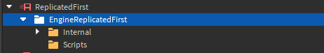

# Custom Loading Screen

The custom loading screen feature allows you to implement a custom loading screen in your game, with almost no hassle at all. It's highly customizable and gives users helpful stats for debugging by default.

### Enabling

To enable the default loading screen, simply tick the attribute to allow the screen to be used:




### Start Loader

To start the loader, you can use the `EngineLoader.StartLoad` function. This allows you to customize the loader a bit and have it fit your game. Here's an example of some loading screen code that you can use as a reference:

```lua
local Internal = script.Parent.Parent.Internal
local EngineLoader = require(Internal.EngineLoader)

EngineLoader.StartLoad(
	{
		"rbxassetid://123",
		"rbxassetid://456"
	}, -- etc.
	
	{
		["This is a message that will show!"] = Color3.fromRGB(222, 255, 130)
	}
)

EngineLoader.CustomizeInterface({
	LoadingSpinner = {
		Visible = false -- This will make it so the loading spinner no longer shows
	}
})
```

You can do lots more with this, but for the sake of simplicity, you can view the API documentation instead.