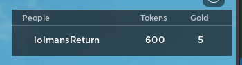

# Data Management

Since storing data for your players is really a must-have in almost any game, we have provided for you one of the best data storing solutions out there. `ProfileService`! Our implementation of `ProfileService` is extremely easy to learn, and is way quicker to setup then the classic ways you would do it.

### Profile Stores

If you have ever used ProfileService before, you have probably heard of the `ProfileStore`. It's basically just a [GlobalDataStore](https://create.roblox.com/docs/reference/engine/classes/GlobalDataStore), but instead of managing keys, it manages individual profiles instead. These profiles are assigned to a unique ID, so they can be assigned to the player's `UserId`, or it can be it's own thing. Though, first, lets create a new `ProfileStore` using the `DataService.CreateProfileStore` function:

```lua
local DataService = CanaryEngineServer.Data
local MyNewDataStore = DataService.CreateProfileStore("MyProfileStore", {Tokens = 100, Gold = 5, Items = {"Wooden Sword"}})
```

After this, you can declare the key pattern if you want to. This is optional though, and the default is 'user_%d' for compatibility with older versions. Though, I recommend just changing to '%d', so it only contains the player's `UserId`.

```lua
local DataService = CanaryEngineServer.Data
local MyNewDataStore = DataService.CreateProfileStore("MyProfileStore", {Tokens = 100, Gold = 5, Items = {"Wooden Sword"}}, "%d") -- Change the pattern if you want to, it's better for usage
```

Now, we can detect when the player joins, and when they do, we can load in their data by using `ProfileStoreObject:LoadProfileAsync`. This will load in the profile and allow you to interact with the data. Since it returns a Future, we will use the `After` method; please also note that you can use the `Await` method as well which will yield the thread and return the profile object. Here's how you would do the latter:

```lua
local DataService = CanaryEngineServer.Data
local PlayerService = game:GetService("Players")
local MyNewDataStore = DataService.CreateProfileStore("MyProfileStore", {Tokens = 100, Gold = 5, Items = {"Wooden Sword"}}, "%d")

-- // Functions

local function PlayerAdded(player)
    MyNewDataStore:LoadProfileAsync(player):After(function(playerProfile)

    end) -- Load the profile, you can also add an optional `reconcile` argument which reconciles the data
end

PlayerService.PlayerAdded:Connect(PlayerAdded)
```

Now sometimes, the player will join before the server script runs. To fix this, we can loop through all of the players after we listen to the player added event, then run the player added function:

```lua
local DataService = CanaryEngineServer.Data
local PlayerService = game:GetService("Players")
local MyNewDataStore = DataService.CreateProfileStore("MyProfileStore", {Tokens = 100, Gold = 5, Items = {"Wooden Sword"}}, "%d")

-- // Functions

local function PlayerAdded(player)
    MyNewDataStore:LoadProfileAsync(player):After(function(playerProfile)

    end)
end

PlayerService.PlayerAdded:Connect(PlayerAdded)

for _, player in PlayerService:GetPlayers() do
    task.spawn(PlayerAdded, player)
end
```

Now we are all set! But first, we have to make sure to unclaim the session lock when the player leaves. Doing this is pretty simple, just add this to your script:

```lua
PlayerService.PlayerRemoving:Connect(function(player)
    MyNewDataStore:UnclaimSessionLock(player)
end)
```

### Profiles

Now we can get started on profiles. As explained in the introduction, profiles are essentially the successor to datastore keys. These are much easier to use and make the process of data saving so much easier. Setting the data here is as simple as editing a table. No getter or setter functions, you can make your own.

What we will do first is get the data we can edit from the profile. In order to do this, you must call `PlayerProfile:GetProfileData`.

```lua
local function PlayerAdded(player)
    MyNewDataStore:LoadProfileAsync(player):After(function(playerProfile)
        local ProfileData = playerProfile:GetProfileData()

        print(ProfileData) -- Output: {Tokens = 100, Gold = 5, Items = {"Wooden Sword"}}
    end)
end
```

Now that we have verified that our code is indeed working, we can now edit the values in the profile data dictionary as so:

```lua
local function PlayerAdded(player)
    MyNewDataStore:LoadProfileAsync(player):After(function(playerProfile)
        local ProfileData = playerProfile:GetProfileData()

        print(ProfileData) -- Output: {Tokens = 100, Gold = 5, Items = {"Wooden Sword"}}
        table.insert(ProfileData.Items, "Iron Sword")
        print(ProfileData) -- Output: {Tokens = 100, Gold = 5, Items = {"Wooden Sword", "Iron Sword"}}
    end)
end
```

We can do quite a bit with this, such as increase the user's cash each time they join, or even remove specific items. When we join back, the iron sword should persist if you set up the profile store correctly. Though, there is one more thing you should learn: `GlobalKey`s.

### Leaderstats

When using EasyProfile, Roblox's player list `leaderstats` are rather easy to setup. You only need to call 1 function. Here's an example of leaderstats being set up when the player joins:

```lua
local function PlayerAdded(player)
    MyNewDataStore:LoadProfileAsync(player):After(function(playerProfile)
        playerProfile:CreateProfileLeaderstats(player, {"Tokens", "Gold"}) -- The leaderstats folder is also returned here, in case you want to mod values
    end)
end
```

When they join, your leaderboard should look just like this: 



### Global Keys

Global keys are a better way of handling cross server communication with data, and you can even send data to offline `UserId`'s. It uses the Global Updates feature of ProfileService internally, and that system is very confusing which is why we made our own. There's really only 3 functions to learn, so it should be pretty straightforward to learn.

To start, we can create and setup our profile store just as how we did previously:

```lua
local DataService = CanaryEngineServer.Data
local PlayerService = game:GetService("Players")
local MyNewDataStore = DataService.CreateProfileStore("MyProfileStore", {Tokens = 100, Gold = 5, Items = {"Wooden Sword"}}, "%d")

-- // Functions

local function PlayerAdded(player)
    MyNewDataStore:LoadProfileAsync(player):After(function(playerProfile)

    end)
end

PlayerService.PlayerRemoving:Connect(function(player)
    MyNewDataStore:UnclaimSessionLock(player)
end)

PlayerService.PlayerAdded:Connect(PlayerAdded)

for _, player in PlayerService:GetPlayers() do
    task.spawn(PlayerAdded, player)
end
```

First, in our `PlayerAdded` function, lets send a new global key out to ourselves by using the `ProfileStoreObject:SetGlobalKeyAsync` method:

```lua
local function PlayerAdded(player)
    MyNewDataStore:LoadProfileAsync(player):After(function(playerProfile)
        MyNewDataStore:SetGlobalKeyAsync(player.UserId, "GlobalKeyTest", "somerandomstringdata") -- The first argument is the player who is recieving it, and the others are the key name followed by the value
    end)
end
```

To listen when the player recieves a new key in-game, you can use the `ProfileObject.GlobalKeyAdded` event, it will fire when a new key is added:

```lua
local function PlayerAdded(player)
    MyNewDataStore:LoadProfileAsync(player):After(function(playerProfile)
        playerProfile.GlobalKeyAdded:Connect(function(data)
            print(data[1]) -- Output: {Key = "GlobalKeyTest", Value = {this = "is a test"}, KeyId = 1}
        end)

        MyNewDataStore:SetGlobalKeyAsync(player.UserId, "GlobalKeyTest", "somerandomstringdata")
    end)
end
```

Please note that when doing this, you must wait around 60 seconds for the key to be recieved. Though next, we should setup a way for us to recieve keys that we got when were offline. In order to do this, you can use the `ProfileObject:GetGlobalKeys` method, it returns a table of global keys that we can loop through:

```lua
local function PlayerAdded(player)
    MyNewDataStore:LoadProfileAsync(player):After(function(playerProfile)
        for _, globalKey in playerProfile:GetGlobalKeys() do
           print(globalKey.Key, ":", globalKey.Value) -- Output: {Key = "GlobalKeyTest", Value = "somerandomstringdata", KeyId = 1}
        end

        playerProfile.GlobalKeyAdded:Connect(function(data)
            print(data[1]) -- Output: {Key = "GlobalKeyTest", Value = "somerandomstringdata", KeyId = 2}
        end)

        MyNewDataStore:SetGlobalKeyAsync(player.UserId, "GlobalKeyTest", "somerandomstringdata")
    end)
end
```

Please do note that there is a difference between `GlobalKey`'s and regular keys. `GlobalKey`'s are supposed to be global: they can be recieved globally, and regular keys are just for the individual player that owns the profile.

### Extras

There are a few extra functions you should know about. Here is a table of them: 

|Function|Description|
|-|-|
|`ProfileObject:GetDataUsage`|Allows you to measure the size of the profile's data, in a percentage (%)|
|`ProfileObject:GetMetaData`|Gets specific meta data about the profile, such as the amount of times it was loaded.|
|`ProfileStoreObject:GetProfileAsync`|Gets the profile data for a specific `UserId`, useful for getting anyones data and overwriting it. Any edited values will not reflect to the profile unless overwrite is called.|