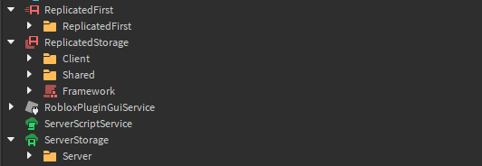

# File Structure

The CanaryEngine file structure aims to be easy to understand, easy to edit, and extremely customizable. Here's a look at the default file structure:

This is how a traditional framework is setup, with the addition of a replicated first folder to nest scripts in. There's really nothing special other than it's the basic and default setup. This setup is recommended, however, you can make your own.

To create your own file structure, navigate to the plugin;

* ***View > Structure***

From here, you can choose the destination folders for scripts and packages. Normally, this would not matter, but to leverage full usage of the plugin, specific folders must be specified or it will not work intendedly. If you have nothing selected, it will go for the default location in the structure first, then the service if all else fails. Please keep in mind you can rename the main folders freely, as these solely rely on tags to be referenced instead of names.

**The framework itself has no reliance on the order of the folders, only the plugin does.**